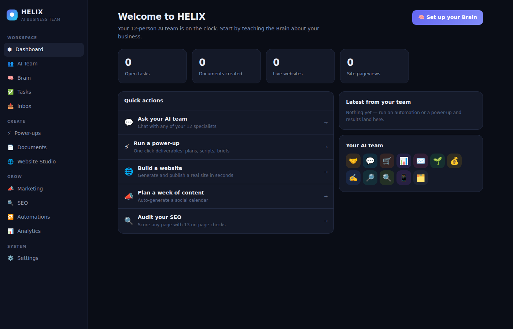

# ⬢ HELIX — Your Local AI Business Team

**HELIX is a local-first rebuild of [sintra.ai](https://sintra.ai)'s core ideas — and then it keeps going.**
Twelve specialized AI employees, a shared business Brain, one-click power-ups,
scheduled automations, a real website builder with live publishing, an SEO
auditor, a marketing hub, and privacy-first analytics. All running entirely on
your machine, with **zero dependencies** and **zero data leaving your computer**.

## Quick start (2 minutes)

HELIX is a **local app** — it runs on *your* computer, and `http://localhost:4310`
only works in a browser **on the machine where it's running**. (If you click a
localhost link on a device that isn't running HELIX, Safari/Chrome will say it
can't connect to the server — that's expected, not a bug.)

1. **Install Node.js** (version 18 or newer) from [nodejs.org](https://nodejs.org) if you don't have it.
2. **Download this repository** (green "Code" button → Download ZIP, then unzip — or `git clone`).
3. **In a terminal, inside the folder:**

```
npm start
```

Then open **http://localhost:4310** in your browser. That's it — no account,
no subscription, no API key required (though you can plug one in), no
`npm install` even. If port 4310 is busy, HELIX automatically picks the next
free port and prints the correct link.

---



## Why this beats a cloud AI-employee subscription

| | Sintra.ai (~$97/mo) | HELIX |
|---|---|---|
| Where your business data lives | Their servers | Your disk (`data/db.json`) |
| Works offline | No | Yes — built-in offline engine |
| Model choice | Theirs | Anthropic, OpenAI-compatible, **local Ollama**, or none |
| Builds & publishes real websites | No | Yes — live at `/sites/<slug>` |
| Real on-page SEO audits | No | Yes — 13 weighted checks, scored reports |
| Site analytics | No | Yes — local, cookie-free pageviews |
| Export everything | Limited | One click, full JSON |
| Price | $1,164/yr | $0, forever |

## Your AI team

| Helper | Role | Helper | Role |
|---|---|---|---|
| 🤝 **Buddy** | Business development | ✍️ **Penn** | Copywriting |
| 💬 **Cassie** | Customer support | 🔎 **Scouty** | Recruiting |
| 🛒 **Commet** | E-commerce | 🔍 **Seomi** | SEO |
| 📊 **Dexter** | Data analysis | 📱 **Soshie** | Social media |
| ✉️ **Emmie** | Email marketing | 🗂️ **Vizzy** | Virtual assistant / ops |
| 🌱 **Gigi** | Growth coaching | 💰 **Milli** | Sales |

Every helper is automatically briefed with your **🧠 Brain** — the business
profile and knowledge base you fill in once. Chats, power-ups, automations,
websites, and campaigns all use it.

## What's inside

- **AI Team chat** — persistent conversations with all 12 specialists.
- **🧠 Brain** — business profile + knowledge items injected into every generation.
- **⚡ Power-ups** — 12 one-click deliverables (content plans, sales scripts,
  proposals, SEO briefs, hiring kits, SOPs…) saved to a documents library.
- **✅ Tasks** — a kanban board where AI teammates can *complete* tasks and
  attach the deliverable.
- **🔁 Automations** — recurring prompts on an interval or daily schedule;
  results land in your Inbox and Documents.
- **🌐 Website Studio** — generates a full, responsive, SEO-ready website from
  your Brain in seconds; edit every section with a live preview; published
  instantly at `http://localhost:4310/sites/<slug>`.
- **📣 Marketing hub** — social content calendar (auto-generate a week of
  platform-native posts) and email campaign drafting.
- **🔍 SEO** — real on-page audits (title, meta, headings, alt text, word
  count, viewport, OG tags…) of Studio sites or any live URL, with weighted
  scores and concrete fixes.
- **📊 Analytics** — cookie-free local pageview tracking for every published site.
- **⚙️ Settings** — pick your AI provider, export/import your entire workspace.

## AI providers

HELIX works out of the box with a built-in **offline engine** — deterministic,
brand-aware, persona-flavored structured output for every feature. For fully
bespoke generation, connect any of these in **Settings**:

| Provider | Needs | Notes |
|---|---|---|
| Offline engine | nothing | default; works forever, fully private |
| Anthropic | API key | e.g. `claude-sonnet-5` |
| OpenAI-compatible | API key | any `/v1/chat/completions` endpoint |
| Ollama | local install | 100% local LLM, e.g. `llama3.2` |

If a provider call fails, HELIX automatically falls back to the offline engine —
the app never breaks.

## Architecture

Pure Node.js standard library. No frameworks, no build step, no `node_modules`.

```
server/
  index.js       HTTP server: SPA, JSON API, published sites
  router.js      tiny method+pattern router
  store.js       atomic JSON persistence (data/db.json)
  helpers.js     the 12 personas + Brain-aware system prompts
  ai.js          provider abstraction with offline fallback
  offline.js     deterministic offline generation engine
  powerups.js    deliverable catalog
  automations.js in-process scheduler
  sites.js       website model → standalone HTML renderer
  seo.js         weighted on-page audit engine
  analytics.js   pageview rollups
public/          vanilla-JS SPA (hash router)
test/            end-to-end API suite (node:test)
```

## Development

```
npm start        # run on http://localhost:4310  (PORT=xxxx to change)
npm test         # 12 end-to-end tests over the real HTTP server
```

All state lives in `data/db.json` (gitignored). Delete it for a factory reset,
or use **Settings → Export/Import** for backups.

## Troubleshooting

- **"Safari can't connect to the server" / "This site can't be reached"** —
  HELIX isn't running on this machine. Open a terminal in the project folder,
  run `npm start`, and use the URL it prints. localhost links never work from
  another device.
- **`node: command not found`** — install Node.js ≥ 18 from [nodejs.org](https://nodejs.org).
- **Wrong or stale data** — stop the server and delete `data/db.json` for a
  factory reset (export a backup first if you want one).
- **A published site 404s** — check it's marked **live** in Website Studio;
  unpublished sites intentionally return 404.
- **Note on backups**: the export file contains everything, including any API
  key you saved in Settings — treat it like a password file.
